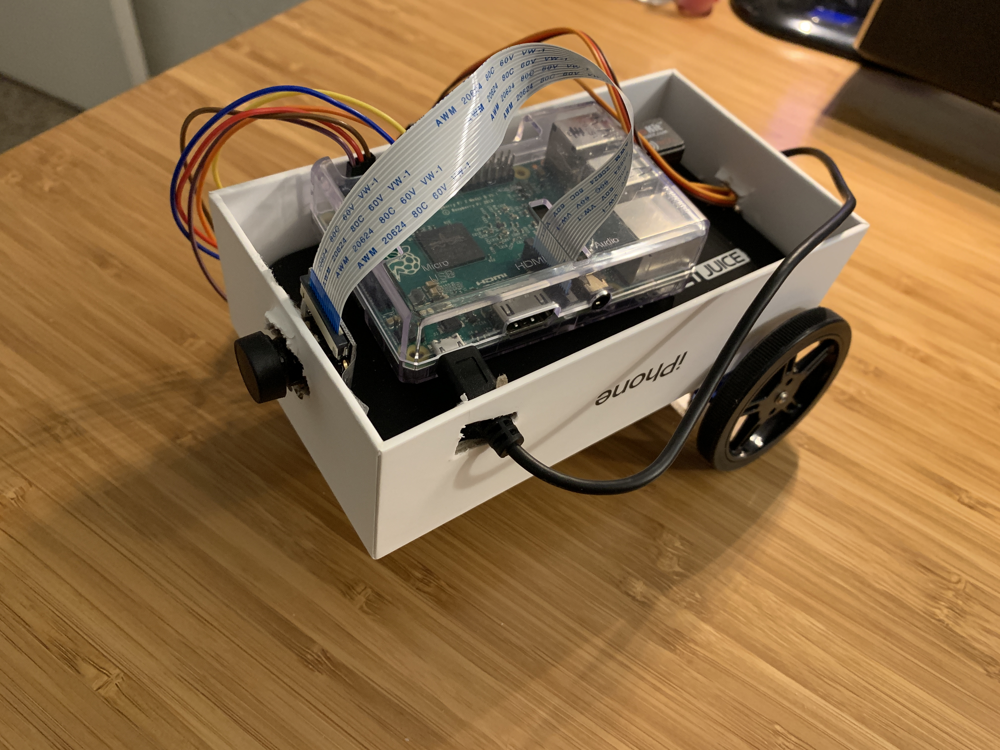
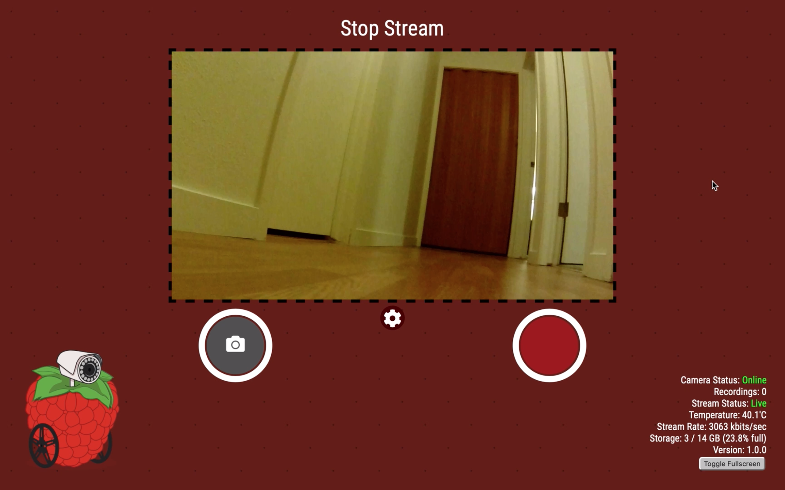

<p align="center">
  <br/>
  <br/><br/>
  <span>A Raspberry Pi + WebRTC Streaming Rover, controlled with Flask-SocketIO</span>
</p>

## About
[](https://github.com/benbusby/raztot/releases/)
[](https://www.gnu.org/licenses/gpl-3.0) [](https://paypal.me/helloben)<br/>
The RazTot is an easy DIY project which allows you to have full control over a roving security camera at your house. The idea for the RazTot was inspired by wanting to have a camera that I could use to follow my dog around the house whenever I'm not home, but I wanted more control over the design. I also didn't like the idea of using any of the available third party closed source solutions, since I would be using this to stream video of my house when I'm not around. 

*For a build guide with pictures, you can visit [the imgur album for the project here](https://imgur.com/a/DZqkBm9).*

## Browser Support (Latest Versions)

| [](http://godban.github.io/browsers-support-badges/)</br>Edge | [](http://godban.github.io/browsers-support-badges/)</br>Firefox | [](http://godban.github.io/browsers-support-badges/)</br>Chrome | [](http://godban.github.io/browsers-support-badges/)</br>Safari | [](http://godban.github.io/browsers-support-badges/)</br>iOS Safari |
| --------- | --------- | --------- | --------- | --------- | 
| :heavy_check_mark:| :heavy_check_mark:| :heavy_check_mark:| :heavy_check_mark:| :heavy_check_mark:|

## Features
- Live video streaming with low (~0.5s) latency
- Server side video recording
- Client side image capture
- Servo control to move around with 360 degree turning capability
- HTTPS web page controls (if configured with Dataplicity or a similar service)
- User authentication restricted streaming and controls

## Parts

| Part | Description | Price
| --- | --- | --- |
| 1 x Raspberry Pi | The main component of the RazTot. I personally recommend getting one that comes with at an SD card and a case (although a case isn't *completely* necessary, I suppose). One that comes with built in WiFi is a good idea as well, otherwise you'll need a WiFi USB stick. | $15-55 |
| 1 x Raspberry Pi Camera | Required for streaming video. | [~$12](https://www.amazon.com/Arducam-Megapixels-Sensor-OV5647-Raspberry/dp/B012V1HEP4/) |
| 2 x servos (with wheels) | These are used to control movement of the RazTot. | [$15](https://www.amazon.com/Feetech-Degree-Continuous-Rotation-Arduino/dp/B079MF1BZS/) |
| 1 x portable power block | Required in order to move around without needing to be plugged into a wall all the time. I use [this one](https://www.amazon.com/gp/product/B0742NFNN9/) since it comes with a fold out AC wall plug, which (in my opinion) is more convenient to charge when it dies, and the 12000mAh version lasts me quite a while. | Price varies ([mine was $24](https://www.amazon.com/gp/product/B0742NFNN9/)) |
| (Optional, but recommended) 1 x mounting surface | Can be 3D printed, or just using materials at your disposal (I used an iPhone box I had lying around). This provides a way to mount the wheels on something without doing any mods to your battery pack. I guarantee one of the boxes that the parts are shipped to you in will work for this. | Varies, can be free |
| (Optional) 1 x 1" caster wheel | This can be used towards the front of the mounting surface to help guide the RazTot. Although you only need one, they generally come in a set. You can most likely use something like a tennis ball cut in half to mount in the front instead. | Varies ([mine were $10](https://www.amazon.com/SungMi-Plastic-Capacity-Included-SM-AMS-210001/dp/B07DS6SF14/), but can be found for cheaper.) | 

**Total:** ~$80-120, depending on parts

*Can be made cheaper with a smaller/lower mAh batter, buying cheaper caster wheels, opting for the Raspberry Pi Zero, etc. I haven't tried a build with the Pi Zero, but I imagine it works about the same (though maybe a little slower).*

## Setup / Installation
### Hardware Setup
#### Camera
To set up the camera, you just insert the non-camera end of the camera's ribbon cable into the connector between the HDMI and Ethernet ports (if not using the Pi Zero). There's a small tab you pull up on to allow the cable to slide into the connector, and then push back in once the cable is in place.

Once the camera is connected, run:
```bash
vcgencmd get_camera
```

You should see ```detected=1``` in the output of the command if the camera was connected properly. 

#### Wheels
The main component that needs setting up is the two servo wheels for the RazTot. This is pretty straightforward and just requires a few male->female jumper cables.

Each motor has three wires: ground (brown), power (red), and signal (yellow). Take three jumper cables and plug the male side into the slots for each wire. With the female side of the cable, attach it to [the correct GPIO pins on the Raspberry Pi](https://pinout.xyz/#). 

Using that pin layout, the power cable for each wheel should go in the top right two pins labelled "5V". The ground cables can go on any pin labelled "Ground" in that diagram. The signal cables can go to any of the BCM pins that don't have labels next to them in parentheses. Keep track of which wire is going where, otherwise the wheels probably won't work. Repeat for the other wheel and you're good to go!

Once you're done, you can run the ```test_motors.sh``` script in the utils/ folder to check if your motors are working properly. The script takes two arguments -- the two BCM pin numbers you plugged the signal cables into (i.e. 17 and 22). 
```bash
./test_motors.sh 17 22
```
*Note: You should have the motors positioned so that the wheel isn't in contact with a surface. Otherwise the wheels will roll around while they're being tested.*
#### IMPORTANT!!!
If you don't use pins 17 and 22, you will need to make a small change to ```app/routes.py``` with the new left/right servo pin numbers. There are only two values to change in that file:
```py
SERVO_L = 17 # Change this one
SERVO_R = 22 # And this one
```

### Software Setup
To setup the RazTot software, power up your Raspberry Pi and run the following commands:
```bash
cd
git clone https://github.com/benbusby/raztot.git
cd raztot/config
./setup.sh
```
The setup script will determine what needs to be installed and walk you through each step of the process. It can take quite a while depending on your network speed, but is a mostly hands off process so you don't need to watch it the whole time.

At the end of the script you'll be prompted to create an account with [dataplicity](https://dataplicity.com/), since they provide the ability to host a website on the RazTot without having to mess around with your router at home. It also provides an https url to access the RazTot with, the domain doesn't change between bootups. I've been pretty satisfied with using dataplicity so far, since the service is free (at least for one device) and comes with a domain you can use rather than buying one yourself. If you'd rather just modify your router settings instead, however, there are plenty of guides online.

Once the script is done, you can run the command
```bash
cd ~/raztot
source run.sh local
```
anytime the Pi is powered on to start the Flask app, Janus server, and pigpio daemon whenever the Pi is powered on. If you set up an account with dataplicity, you can log into their web portal to view the domain that was assigned to your Pi. Navigating to that domain should bring you to the main app, where you can start using the RazTot.

### Controls
- Streaming is controlled via the web app using the Start/Stop Stream button at the top of the web page. 
- Image capture is done via the grey button with the camera icon just below the streaming window.
- Recording snippets of the stream can be accomplished using the red recording button below the stream once the stream is running. 
- You can view a list of prior recordings, clear all recordings, and log out using the gear icon below the stream.
- Motion is achieved using the arrow keys on your keyboard, or by pressing the arrow key buttons on the web page. Each key will send a command to the RazTot to move wheels accordingly for whichever direction you are trying to navigate.

## Images



For more images, see [the Imgur album](https://imgur.com/a/DZqkBm9).

## Credits
- RazTot logo by [Ren Chu](https://artbyren.com) ([Instagram](https://instagram.com/art.by.ren))
- Special thanks to [Meetecho/Janus Gateway](https://github.com/meetecho/janus-gateway)
